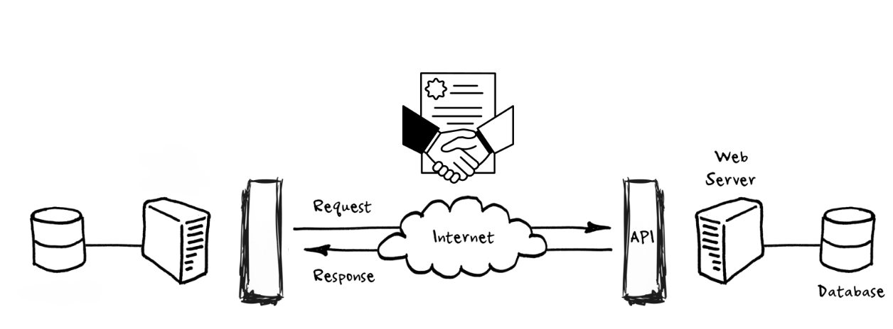
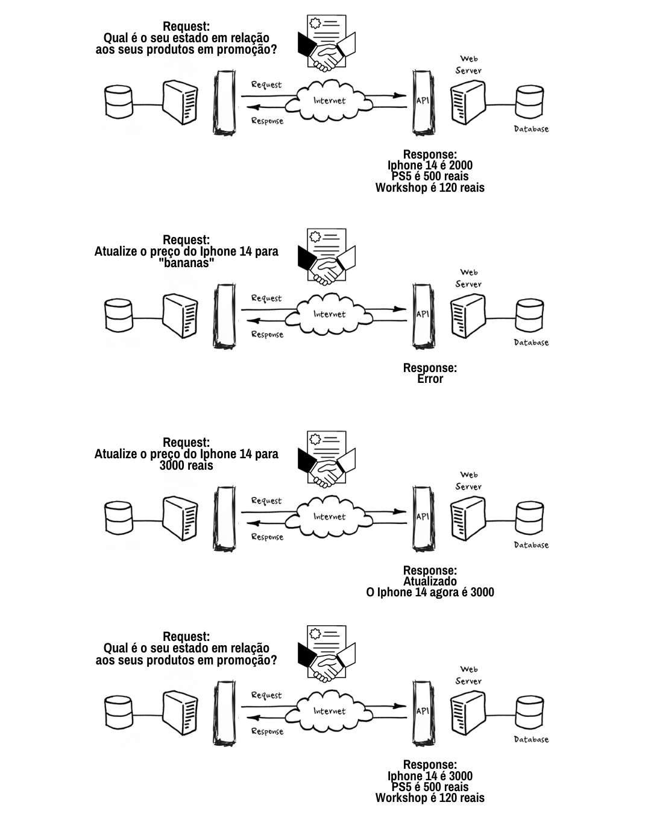

# Class 18: API - Set of tools to manipulate SQL

Welcome to the eighteenth bootcamp class!

# What is an API?

An API (Application Programming Interface) is a set of routines and standards (contracts) established by an application, so that other applications can use the functionalities of that application.

# Why use an API?

In recent years, the Internet has transformed from a network of web servers that served mostly static pages to web browsers...


...in a client-server architecture, where web and mobile applications communicate with different applications, increasingly through simple but powerful RESTful APIs.


# The rules of the game

Basically, an API is a contract that defines how one application will communicate with another. How data will be sent and received.



# What is a REST API?

REST is an acronym for REpresentational STATE Transfer, which is an architectural style for distributed systems.



# How to communicate with her?

- Our protocol (e.g. https)

- Our server has an address (ex: pokeapi.co)

- Our server has a port (ex: 8080 for http and 443 for https)

- And we need to access a resource or as we usually call it, endpoint or route (ex: /api/character)

``` 
https://pokeapi.co/api/v2/pokemon/15
```

# Our verbs

The HTTP protocol is the basis used behind REST APIs and "requests" them using several "types". The most common are:

## What is CRUD? 

Create, Read, Update and Delete

- POST: (Create) Create a resource
- GET: (Read) Get a resource
- PUT: (Update) Update a resource
- DELETE: Remove a resource

# What is the difference between REST and RESTful?

REST is an architectural style for distributed systems, while RESTful is the implementation of that style.

# Shall we go to practice?

Let's use VScode and the terminal to connect and save data from an API to a database.